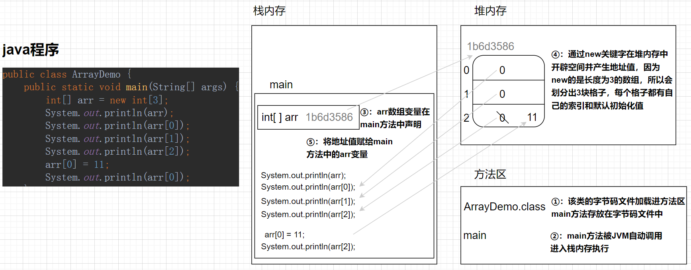

# java核心基础学习笔记

该笔记包含以下部分：

1. <a href="#chapter01">java基础语法</a>
2. <a href="#chapter02">面向对象基础</a>
3. <a href="#chapter03">常用API</a>
4. <a href="#chapter04">面向对象进阶</a>
5. <a href="#chapter05">集合</a>
6. <a href="#chapter06">IO流</a>
7. <a href="#chapter07">多线程</a>
8. <a href="#chapter08">网络编程</a>
9. <a href="#chapter09">反射</a>
10. <a href="#chapter10">单元测试</a>
11. <a href="#chapter11">日志</a>
12. <a href="#chapter12">java新版本更新介绍</a>


## <a id="chapter01">chapter01-java语法基础</a>

### 1.1环境搭建与HelloWorld

#### 1.1.1环境搭建

在<a href="http://www.oracle.com">Oracle官网</a> 下载JDK进行安装，具体安装步骤以及环境配置步骤网上教程很多，不再赘述。

JDK包含JRE和开发工具；JRE包含JVM和核心类库。

JDK：Java Development Kit缩写，是java语言的软件开发工具包，内部包含了代码的编译工具和运行工具（JRE）。

JRE：Java Runtime Environment缩写，指的是java运行环境，包含JVM虚拟机和Java核心类库。


#### 1.1.2HelloWorld

```java
package chapter01.demo01;

/**
 * @author https://github.com/junlibs
 * @date 2023-01-13
 * @Description
 */
public class HelloWorld {
    public static void main(String[] args) {
        System.out.println("Hello, World!");
    }
}
```

public 为类或类的成员的访问修饰符。在同一个java源文件中可以包含多个类定义，但是最多只能包含一个public类定义。

| 修饰符          | 同类 | 同包 | 子类 | 不同包 |
| --------------- | ---- | ---- | ---- | ------ |
| public          | √    | √    | √    | √      |
| protected       | √    | √    | √    | ×      |
| default（不写） | √    | √    | ×    | ×      |
| private         | √    | ×    | ×    | ×      |

class 为类声明，其后跟类名，类名的首字母要大写，类名需要与文件名保持一致。

static 为静态声明关键字，可以修饰类的成员变量称为静态变量，可以修饰类的成员方法称为成员方法，也可以用来修饰代码块成为静态代码块或静态初始化器，还可以修饰内部类称为静态内部类。

void 为返回值，表示该方法没有返回值。

main(String[] args)为程序的入口方法，括号中为形参列表，String[] args即字符串数组，用来接收传进来的参数。

System为java.lang包下的类，在java.lang包下的类不用手动导入，可以直接用。System类中有3个静态成员变量，分别是，标准输出流PrintStream out、标准输入流InputStream in、标准的错误输出流PrintStream err。

println为标准输出流中的方法，用来在控制台打印内容。


### 1.2基础语法

#### 1.2.1注释

java中分三种注释：单行注释、多行注释、文档注释。

```java
package chapter01.demo02;

/**
 * @author https://github.com/junlibs
 * @date 2023-01-13
 * @Description 此处就是文档注释，用来说明程序的一些信息，在方法上也可以添加文档注释
 */
public class Comments {
    public static void main(String[] args) {
        //这是单行注释，用两个斜线表示

        /*
        * 这是多行注释，开头用/和*，结尾用*和/
        * */
    }
}
```


#### 1.2.2关键字和标识符

java中有一些特殊用途的单词被称为关键字，比如，new、if、public、static等。java中所有的关键字都是小写的。

注，java10中引入的var并不是关键字，它相当于一个可变的类型名。

标识符就是用于给变量、类、方法命名的符号。

java中的标识符，由字母、数字、下划线、$符组成，且不能以数字开头。且不能以关键字命名。

注，由于var不是关键字，因此var可作为标识符，但是不建议使用它来作为标识符。

```java
package chapter01.demo03;

/**
 * @author https://github.com/junlibs
 * @date 2023-01-13
 * @Description 标识符和关键字
 */
public class Identifier {
    public static void main(String[] args) {
        int $money = 10;//可以以$开头
        int _money = 20;//可以以_开头
        int money = 30;//可以以字母开头
        int money_66_$ = 40;//标识符可以由字母、数字、下划线、$符组成
        System.out.println($money);
        System.out.println(_money);
        System.out.println(money);
        System.out.println(money_66_$);
    }
}
```


#### 1.2.3变量和常量

变量，就是内存中的存储空间。变量的作用域，只在它所在的大括号中有效。

常量，即在程序的执行过程中，其值不会改变的数据，一旦初始化就不可以被修改。java中使用final关键字来定义一个常量。final的具体用法参见面向对象中的讲解。

```java
package chapter01.demo04;

/**
 * @author https://github.com/junlibs
 * @date 2023-01-13
 * @Description 常量和变量
 */
public class VariableAndConstant {
    //静态常量（类变量）
    public static final double PI = 3.14;

    //成员常量
    final int x = 10;

    public static void main(String[] args) {
        //局部常量
        final int age = 18;

        System.out.println(PI);//3.14
        //System.out.println(x);//编译报错，x未用static修饰，不能在静态方法中访问。
        System.out.println(age);//18

        //局部变量，使用前必须手动赋值
        String name = "张三";
        System.out.println(name);//张三
        name = "李四";
        System.out.println(name);//李四
    }
}
```


#### 1.2.4 数据类型

java中的的数据类型分为基本数据类型和引用数据类型。

- 基本数据类型：

  有：byte、short、int、long、float、double、char、boolean，它们所占内存空间大小依次为(单位:字节)，1,、2、4、8、4、8、2、1。

  byte取值范围是[-128, 127]；默认值是0。

  short的取值范围是[-2^15, 2^15 - 1]；默认值是0。

  int的取值范围是[-2^31, 2^31 -1]；默认值是0.

  long的默认值是0L。

  float的默认值是0.0f。

  char的默认值是\u0000。

  double的默认值是0.0d。

  boolean的默认值是false。

- 引用数据类型：

  有：类class、接口interface、数组[]。关于引用数据类型的具体介绍参见面向对象中的讲解。

```java
package chapter01.demo05;

/**
 * @author https://github.com/junlibs
 * @date 2023-01-13
 * @Description 基本数据类型
 */
public class Datatype {
    static int staticNum;//类的成员变量，如果不给初值，JVM会赋默认值
    public static void main(String[] args) {
        //局部变量在使用之前必须进行赋值
        byte byteNum1 = -128, byteNum2 = 127;//一条语句定义多个变量，用逗号分隔
        short shortNum = 128;
        int intNum = 10;
        long longNum = 100;
        float floatNum = 10.1f;//值后必须加f
        double doubleNum = 200.1;
        char charNum = 'a';
        boolean booleanNum = false;
        System.out.println(byteNum1);
        System.out.println(byteNum2);
        System.out.println(shortNum);
        System.out.println(intNum);
        System.out.println(longNum);
        System.out.println(floatNum);
        System.out.println(doubleNum);
        System.out.println(charNum);
        System.out.println(booleanNum);
        //类的成员变量在使用前可以不赋值，由JVM赋默认值
        System.out.println(staticNum);
    }
}
```


#### 1.2.5 类型转换

java支持隐式类型转换和显式类型转换。

隐式类型转换：取值范围小的类型给取值范围大的类型，可以直接给。

注，byte、short、char三种数据在运算的时候，不管是否有更高的数据类型，都会提升为int，然后再进行运算。

如果是常量运算，存在<mark>**常量优化机制**</mark>：会在编译的时候，先进行运算，然后自动判断是否在其要求的类型的取值范围内，如果不在范围内，编译出错；如果在范围内，则编译通过。

- byte ——> int
- short ——> int
- char ——> int
- int ——> long；int ——> float；int ——> double
- long ——> float；long ——> double
- float ——> double

显示类型转换，又叫强制类型转换，即，取值范围大的给范围小的变量赋值，需要强制转换。强转可能会发生精度损失。

```java
package chapter01.demo06;

import java.lang.reflect.Field;

/**
 * @author https://github.com/junlibs
 * @date 2023-01-13
 * @Description
 */
public class TypeConversion {
    public static void main(String[] args) throws Exception {
        //隐式转换：可以直接进行赋值
        int number = 10;
        double doubleNum = number;//发生了隐式转换
        System.out.println(number);//10
        System.out.println(doubleNum);//10
        //强制转换
        byte a = 11;
        int b = (byte)a;
        System.out.println(b);//11
        //byte、short、char三种数据在运算时，都会提升为int再运算。
        byte x = 1;
        byte y = 2;
        int w = x + y;
        byte m = (byte) (x + y);
        System.out.println(w);//3
        System.out.println(m);//3
        
        //java常量优化机制
        byte n = 3 + 4;
        System.out.println(n);//3+4先运算，结果为7，在byte范围内，编译通过
        //byte u = 127 + 4;//127+4的结果超出127，编译出错
    }
}
```


#### 1.2.6运算符

算术运算符：+、-、*、/、% 。

- 整数除法操作只能得到整数，要想得到小数，必须有浮点数参与运算。
-  a % b 的结果是 a - (a / b) * b。
- 字符的“+”操作，字符类型要先提升为int类型再参与运算。
- 字符串的“+”操作，可以进行字符串的拼接，字符串可以用"+"拼接任意类型。

java中的自增、自减运算符，可以放变量后，也可以放变量前。可以单独使用，也可以在表达式中使用。

赋值运算符：=、+=、-=、*=、/=、%= 。

- +=这类复合的赋值运算符，底层自带强转，可以避免short、byte类型参与运算时发生的类型转换错误。

关系运算符（比较运算符）：==、!=、>、<、>=、<= 。返回结果是boolean值，只能是true或者false。

逻辑运算符：与 &、或 |、非 !、异或 ^ 。返回值为boolean类型的值。

短路逻辑运算符：短路与&&、短路或 ||  。若运算符前的得到结果足以支撑最终结果，就不再执行符号后的值。

三元运算符： 格式： `关系表达式 ? 表达式1: 表达式2;`

```java
package chapter01.demo07;

/**
 * @author https://github.com/junlibs
 * @date 2023-01-14
 * @Description
 */
public class Operator {
    public static void main(String[] args) {
        //算术运算符有 +、-、*、/、%
        //字符的“+”运算，字符类型要先提升为int再参与运算
        int a = 1;
        char b = 'a';
        System.out.println(a + b);//98
        //字符串的“+”
        System.out.println(1 + 1 + "java");//2java
        System.out.println("1 + 1 = " + 2 + 2);//1+1=22

        //自增自减运算符，可以放变量后，也可以放变量前。可以单独使用，也可以在表达式中使用
        int num = 10;
        System.out.println(num + num++);//20
        System.out.println(num);//11

        //+=、-=、/=、%= 这类复合的赋值运算符，可以避免类型转换错误
        short numShort = 10;
        numShort += 4;
        System.out.println(numShort);

        //关系运算符，返回值为boolean值
        System.out.println(4 == 5);//falsle

        //逻辑运算符，&、|、！、^ 。返回值为boolean值
        System.out.println(true & false);//false

        //短路逻辑运算符：&&、||
        int x = 3;
        int y = 4;
        System.out.println(++x > 4 && y-- < 5);//false
        System.out.println("x:" + x);//4
        System.out.println("y:" + y);//4

        //三元运算符
        int num1 = 10;
        int num2 = 20;
        int max = num1 > num2 ? num1 : num2;
        System.out.println(max);
    }
}
```


#### 1.2.7 if语句、if-else语句、if-else if-else语句

```java
package chapter01.demo08;

/**
 * @author https://github.com/junlibs
 * @date 2023-01-14
 * @Description
 */
public class If {
    public static void main(String[] args) {
        //if语句
        int age = 19;
        if (age >= 18) {
            System.out.println("成年了");
        }

        //if-else语句
        int num = 3;
        if (num % 2 == 0) {
            System.out.println("偶数");
        } else {
            System.out.println("奇数");
        }

        //if-else if-else语句
        int score = 80;
        if (score >= 90) {
            System.out.println("优秀");
        } else if (score >= 80) {
            System.out.println("良好");
        } else if (score >=70) {
            System.out.println("中等");
        } else if (score >= 60) {
            System.out.println("及格");
        } else {
            System.out.println("不及格");
        }
    }
}
```

#### 1.2.8 switch语句

格式：

```
switch(表达式){
    case 值1:
        语句体1;
        break;
    case 值2:
        语句体2;
        break;
    //...
    default:
        语句体n+1;
        break;
}
```

执行流程：

1. 首先计算表达式的值。
2. 依次和case后面的值进行比较，如果有对应的值，就会执行相应的语句，在执行的过程中，遇到break就会结束。
3. 如果所有的case后面的值和表达式的值都不匹配，就会执行default里面的语句体，然后结束整个switch语句。

注意事项：

- 表达式：就是将要匹配的值，**类型可以是byte、short、int、char，JDK5以后可以是枚举，JDK7以后可以是String**。
- case：后面跟的是要和表达式进行比较的值，即被匹配的值。
- break：表示结束的意思，用来结束switch语句。**break可以省略，省略后发生case穿透**。
- deault：表示所有情况都不匹配的时候，就执行该处的内容，和if语句的else相似。default可以可以省略，语法不会有问题，但是不建议省略。default不一定写在最下面，可以在任意位置，但是规范的代码编写就应该写最下面。
- **case后面的值只能是字面量/常量，不能是变量**。
- case给出的值不允许重复。

switch新特性（JDK12）-Lamda表达式：

举例说明：需求，判断数字是1,2,3，分别打印汉字一，二，三。

- JDK12之前的实现方式

```java
//JDK12之前
public class SwitchDemo {
    public static void main(String[] args) {
        int number = 1;
        switch (number) {
            case 1:
                System.out.println("一");
                break;
            case 2:
                System.out.println("二");
                break;
            case 3:
                System.out.println("三");
                break;
            default:
                System.out.println("没有这种选项");
                break;
        }
    }
 }
```

- JDK12之后的实现方式，除了上面代码的方式之外，还可以使用Lamda表达式进行简化书写

```java
//JDK12之后
public class SwitchDemo {
    public static void main(String[] args) {
        int number = 1;
        switch (number) {
                case 1 -> {
                    System.out.println("一");
                }
                case 2 -> {
                    System.out.println("二");
                }
                case 3 -> {
                    System.out.println("三");
                }
                default -> {
                    System.out.println("没有这种选项");
                }
        }
    }
}
```

- 如果case后面的语句体中只有一行代码，也可以把大括号进行省略

```java
//如果case后面的语句体中只有一行代码，也可以把大括号进行省略
public class Demo {
    public static void main(String[] args) {
        int number = 1;
        switch (number) {
                case 1 -> System.out.println("一");
                case 2 -> System.out.println("二");
                case 3 -> System.out.println("三");
                default -> System.out.println("没有这种选项");
        }
    }
}
```

- switch执行后的结果也可以保存到变量中，即用一个变量接收结果。如，String s = switch(...) {...}。


#### 1.2.9 for循环

```java
package chapter01.demo10;

/**
 * @author https://github.com/junlibs
 * @date 2023-01-14
 * @Description
 */
public class ForDemo {
    public static void main(String[] args) {
        //for循环打印9*9乘法表
        for (int i = 1; i < 10; i++) {
            for (int j = 1; j <= i; j++) {
                System.out.printf("%d * %d = %d\t", j, i, i * j);
            }
            System.out.println();
        }
    }
}
```

for的死循环：`for(;;){}`


#### 1.2.10 while循环

```java
package chapter01.demo11;

/**
 * @author https://github.com/junlibs
 * @date 2023-01-14
 * @Description
 */
public class WhileDemo {
    public static void main(String[] args) {
        //while循环打印9*9乘法表
        int i = 1;
        while( i < 10) {
            int j = 1;
            while (j <= i) {
                System.out.printf("%d * %d = %d\t", j, i, i * j);
                j++;
            }
            System.out.println();
            i++;
        }
    }
}
```

while的死循环：`while(true) {}`


#### 1.2.11 do-while循环

```java
package chapter01.demo12;

/**
 * @author https://github.com/junlibs
 * @date 2023-01-14
 * @Description
 */
public class DoWhileDemo {
    public static void main(String[] args) {
        //while循环打印9*9乘法表
        int i = 1;
        do {
            int j = 1;
            do {
                System.out.printf("%d * %d = %d\t", j, i, i * j);
                j++;
            } while (j <= i);
            i++;
            System.out.println();
        } while (i < 10);
    }
}
```

do-while的死循环：`do{} while(true);`


#### 1.2.12 break和continue在循环中的使用

continue是跳过某一次循环体的执行，继续下一次的执行。

break是终止当前的整个循环。


#### 1.2.13 Random类-猜数字

需求：程序自动生成一个1~100之间的数字，规定最多猜5次。

```java
package chapter01.demo13;

import java.util.Random;
import java.util.Scanner;

/**
 * @author https://github.com/junlibs
 * @date 2023-01-14
 * @Description
 */
public class RandomDemo {
    public static void main(String[] args) {
        //程序自动生成一个1~100之间的数字
        Random random = new Random();
        int randomNum = random.nextInt(100) + 1;

        //规定最多猜测次数
        int total = 5;

        //计数器，用来记录用户猜测次数
        int count = 0;

        //flag，标记用户是否猜对，true表示没有猜对
        boolean flag = true;

        //用户输入猜测数字
        Scanner scanner = new Scanner(System.in);

        //如果没有猜对，并且次数没达到上限，就可以继续猜
        while (flag && count < total) {
            System.out.println("请输入您的猜测：");
            //用户输入猜测的数字
            int guessNum = scanner.nextInt();
            //判断是否猜对
            if (guessNum == randomNum) {
                System.out.println("恭喜你，猜对了");
                flag = false;
            } else if (guessNum > randomNum) {
                System.out.println("很遗憾，您猜的数字太大了");
                count++;
                System.out.println("你还有" + (total - count) + "次机会");
            } else {
                System.out.println("很遗憾，您猜的数字太小了");
                count++;
                System.out.println("你还有" + (total - count) + "次机会");
            }
        }
    }
}
```


#### 1.2.14 数组

java中的数组，存储的是同种数据类型的多个值。

- 声明格式一： `数据类型[] 变量名`；
- 声明格式二：`数据类型 变量名[]`.

动态初始化：只需要指定数组长度，元素值由系统赋默认值。`数据类型[] 变量名 = new 数据类型[数组长度];`

静态初始化：在初始化时，指定数组元素值，而长度会由系统自动计算出。`数据类型[] 变量名 = new 数据类型[] {数据1, 数据2,...};`或者简化格式：`数据类型[] 变量名 = {数据1, 数据2, ...};`

数组的遍历：使用循环，利用数组的length属性。

```java
package chapter01.demo14;

/**
 * @author https://github.com/junlibs
 * @date 2023-01-16
 * @Description
 */
public class ArrayDemo {
    public static void main(String[] args) {
        int[] arr = new int[3];//动态初始化
        System.out.println(arr);//[I@1b6d3586
        System.out.println(arr[0]);//0
        System.out.println(arr[1]);//0
        System.out.println(arr[2]);//0
        arr[2] = 11;
        System.out.println(arr[2]);//11
        
        int[] arrInt = {11, 22,33};//静态初始化
        System.out.println(arrInt[0]);
        System.out.println(arrInt[1]);
        System.out.println(arrInt.length);//3
    }
}
```


#### 1.2.15 java中的内存分配-简述

栈内存：方法运行时，进入的内存。局部变量都存放于这块内存当中。

堆内存：new出来的内容都会进入堆内存，并且会存在地址值。

方法区：字节码文件（.class）加载时进入的内存。

本地方法栈：调用操作系统相关资源。

寄存器：交给cpu去使用的。

以一个一维数组为例：简图如下。




#### 1.2.16 方法概述及方法重载

方法就是一段具有独立功能的代码块，不调用不执行。方法的出现，可以提高代码的复用性。方法与方法之间是平级关系，不能嵌套定义。

方法的参数，如果传递的是基本数据类型，就是传递的具体的值；如果传递的是引用数据类型，就是传递的内存地址值。

方法重载：在同一个类中，方法名形同，参数不同的方法。

- 参数不同：或个数不同，或类型不同，或顺序不同。顺序不同可以构成重载，但是不建议！
- 识别方法之间是否是重载关系，只看方法名和参数，跟返回值无关。

```java
package chapter01.demo15;

/**
 * @author https://github.com/junlibs
 * @date 2023-01-26
 * @Description
 */
public class MethodOverload {
    public static void main(String[] args) {
        boolean result1 = compare(10, 20);
        boolean result2 = compare(10.1, 20.1);
        System.out.println(result1);
        System.out.println(result2);
    }

    public static boolean compare(int a, int b) {
        return a == b;
    }

    public static boolean compare(double a, double b) {
        return a == b;
    }
}
```


## <a id="chapter02">chapter02-面向对象基础</a>

## <a id="chapter03">chapter03-常用API</a>

## <a id="chapter04">chapter04-面向对象进阶</a>

## <a id="chapter05">chapter05-集合</a>

## <a id="chapter06">chapter06-IO流</a>

## <a id="chapter07">chapter07-多线程</a>

## <a id="chapter08">chapter08-网络编程</a>

## <a id="chapter09">chapter09-反射</a>

## <a id="chapter10">chapter10-单元测试</a>

## <a id="chapter11">chapter11-日志</a>

